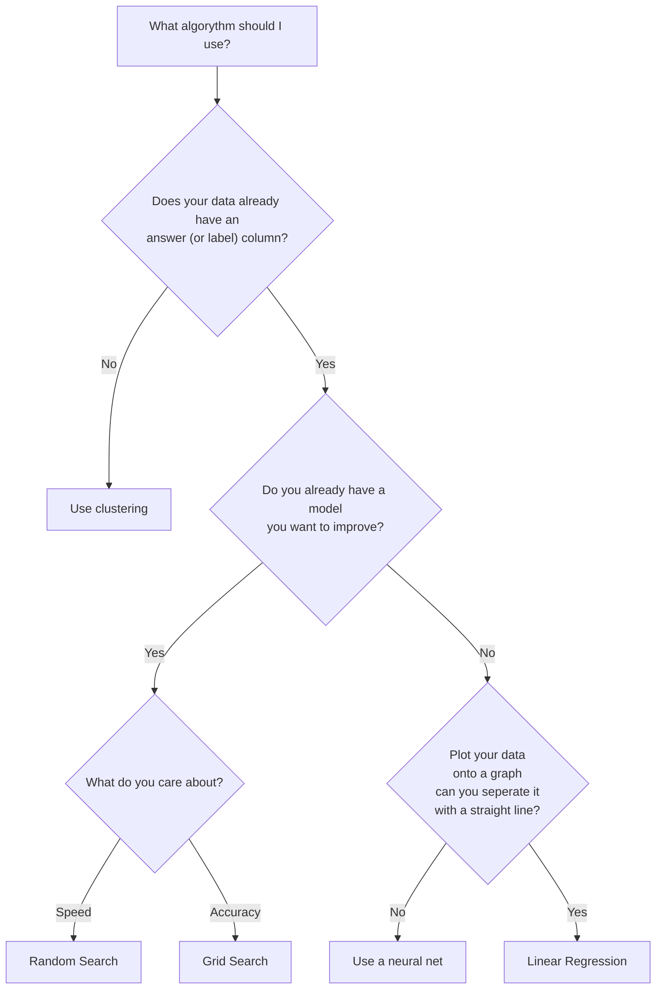
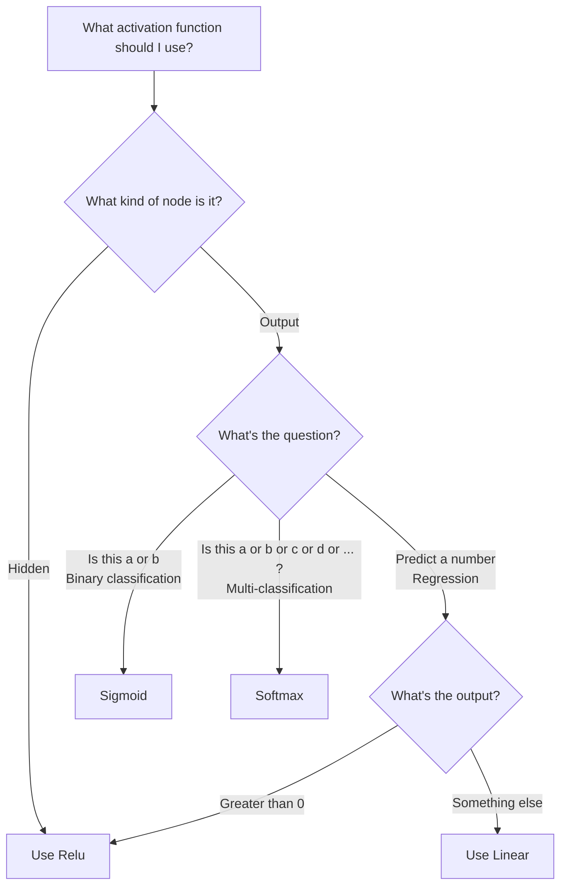
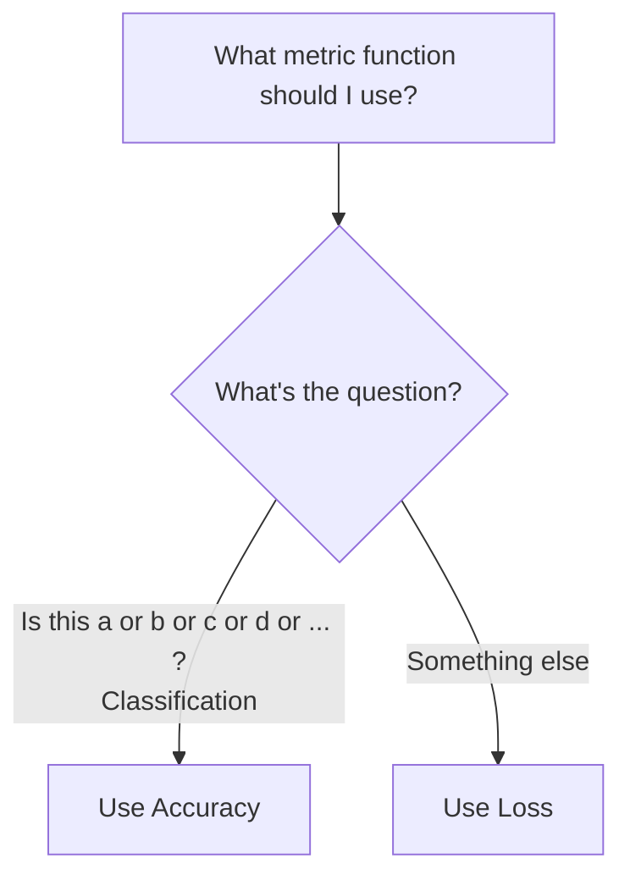
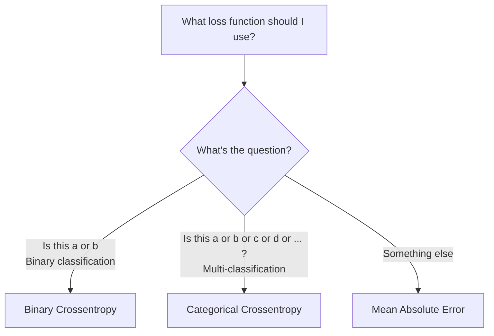

# Flow Charts to make Machine Learning Easier

**Note:** these are rules of thumb 👍, not hard laws. They are designed for people (well me, it's mostly designed for [me](https://github.com/PurpleBooth)) from a software development world who are learning about 🖥️ machine learning 🧑‍🏫, to stop them from getting unexpected results. 

More experienced 🔢mathemagicians✨ or 👨‍🔬 data scientists 👩‍🔬 might recommend something else.

## Problem Selection

First question is do you need a neural net. They aren't always the best thing

## Neural Nets

It looks like a neural net is your best option, how should it be setup?

### What activation function should I use?

*  https://stackoverflow.com/questions/63883842/can-relu-be-used-at-the-last-layer-of-a-neural-network
*  https://dataaspirant.com/difference-between-softmax-function-and-sigmoid-function/
*  https://patrickhoo.wixsite.com/diveindatascience/single-post/2019/06/13/activation-functions-and-when-to-use-them

### What metric function should I use?

### What loss function should I use?

