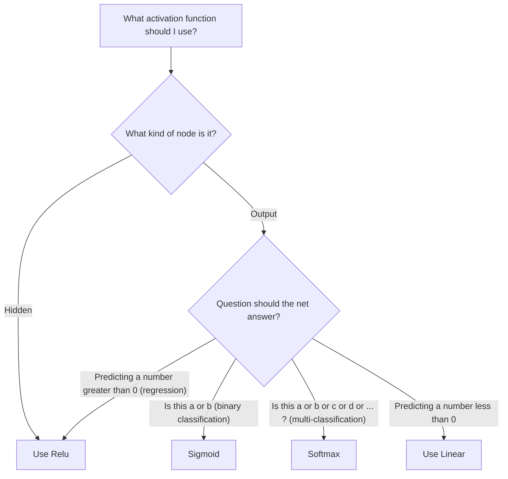

# Flow Charts to make Machine Learning Easier

```mermaid
graph TD
    A[What activation function should I use?] --> B{"What kind of node is it?"}
    B -->|Hidden| C[Use Relu]
    B -->|Output| D{"Question should the net answer?"}
    D -->|"Is this a or b (binary classification)"| E[Sigmoid]
    D -->|"Is this a or b or c or d or ... ? (multi-classification)"| F[Softmax]
    D -->|"Predicting a number greater than 0 (regression)"| C[Use Relu]
    D -->|"Predicting a number less than 0"| G[Use Linear]
```
