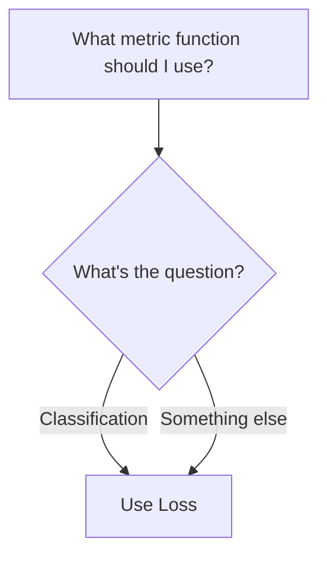
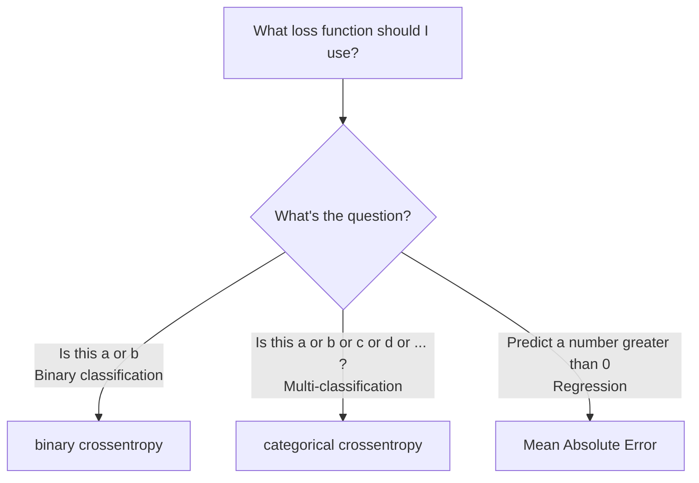

# Flow Charts to make Machine Learning Easier

## What activation function should I use?

*  https://stackoverflow.com/questions/63883842/can-relu-be-used-at-the-last-layer-of-a-neural-network
*  https://dataaspirant.com/difference-between-softmax-function-and-sigmoid-function/
*  https://patrickhoo.wixsite.com/diveindatascience/single-post/2019/06/13/activation-functions-and-when-to-use-them

## What metric function should I use?

## What loss function should I use?

